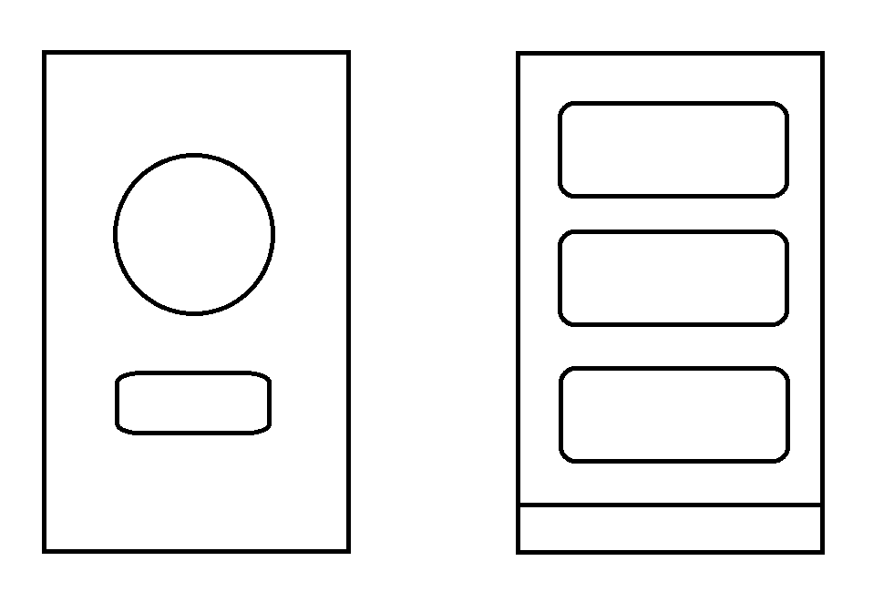
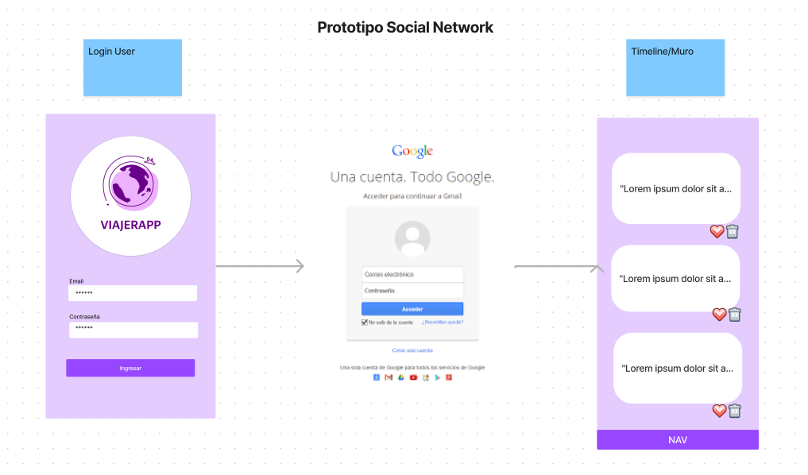

## Viajerapp Social Network

## Índice

* [1. Resumen del proyecto](#1-resumen-del-proyecto)
* [2. Principales usuarios del producto](#2-Principales-usuarios-del-proyecto)
* [3. Historias de usuario](#3-Histrias-de-usuario)
* [4. Prototipo de baja fidelidad](#4-Prototipo-de-baja-fidelidad)
* [5. Prototipo de alta fidelidad](#5-Prototipo-de-alta-fidelidad)
* [6. Autor](#6-Autor)
* [7. Skills](#7-Skills)

# Resumen del Proyecto

Viajerapp es una Single-page Application (SPA) desarrollada en Firebase. Es una red social para viajeras que les permite crear comunidad, conectarse y compartir información sobre viajes, alojamientos, panoramas, tips, entre otros.
Las principales funcionalidades incluyen: inicio de sesión automático con Google, publicación de información sobre viajes y eliminación de publicaciones existentes.

## 2.Principales usuarios del producto

Las principales usuarias del producto son mujeres que les guste viajar o que quieren dar el primer paso para empezar a viajar solas, de forma más segura, creando una comunidad de apoyo, conectando a mujeres de diferentes lugares que pueden compartir información, hospedajes, panoramas, etc.

### ¿Qué problema resuelve el producto?
Al proporcionar una aplicación específica para mujeres viajeras, el producto ofrece a las usuarias una forma conveniente de conectar, interactuar y compartir información relacionada con viajes, una comunidad que busca que se puedan sentir más seguras y atreverse a viajar, sobretodo si lo quieren hacer solas.

### ¿Para qué le servirá esto a los usuarios?

* Conexión y comunidad: Les permitirá conectarse con otras viajeras, creando una comunidad donde puedan compartir experiencias, panoramas, alojamientos, información, etc.

* Interacción social: Proporcionará un espacio seguro donde las usuarias podrán interactuar, dar "like" a las publicaciones de otras viajeras, compartir panoramas, juntarse, etc.

## 3.Historias de usuario

### Inicio de sesión automático con Google:
Como usuaria, quiero poder acceder automáticamente con mi cuenta vinculada en google, para facilitar el proceso de inicio de sesión.

* Criterios de aceptación:
  -  En la página de inicio de sesión, debe haber una opción para iniciar sesión con Gmail.
  -  Al seleccionar la opción de inicio de sesión con Gmail, debo ser redirigido a la página de autenticación de Gmail.
  -  Después de autenticarme exitosamente con Gmail, debo ser redirigido a la pantalla de publicaciones.

* Definición de terminado :
  -  En la página de inicio de sesión, se muestra un botón para iniciar sesión con Gmail.
  -  Al seleccionar la opción de inicio de sesión con Gmail, se redirige al usuario a la página de autenticación de Gmail.
  -  Después de autenticarse exitosamente con Gmail, el usuario es redirigido a la pantalla de publicaciones.

### Publicar:
Como viajera quiero poder ver y publicar información sobre viajes, compartir información, preguntar datos.

* Criterios de aceptación :
  -  Debe tener un área donde pueda escribir y publicar contenido.
  -  Al publicar debe ser visible a cualquier usuario.

* Definición de terminado :
  -  Se ha implementado un área de publicaciones en la página principal. 
  -  El área permite ingresar texto.
  -  Al publicar se muestra correctamente en la página principal, siendo visible a todos los usuarios.

### Borrar una publicación:
Como usuaria de la Red Social de viajeras, quiero poder eliminar mis publicaciones existentes si ya no deseo que estén disponibles en la plataforma.

* Criterios de aceptación :
  -  En la página de detalle de una publicación, debo tener la opción de eliminarla si soy el autor.
  -  Al confirmar la eliminación, la publicación debe desaparecer de la página principal.

* Definición de terminado : 
  -  En la página de detalle de una publicación, debo tener la opción de eliminarla si soy el autor.
  -  Al confirmar la eliminación, la publicación debe desaparecer de la página principal.

  ## 4.Prototipo de baja

  

  ## 5.Prototipo de alta

    

     - [Prototipo en FIGMA](https://www.figma.com/file/wKEQPUAEzyf27UYtw3SwiM/Untitled?type=whiteboard&node-id=0-1&t=LR5RHiS118MB251x-0)

## Autor

- [@claudiamartinezv](https://github.com/claudiamartinezv)

## 🛠 Skills
Javascript, HTML, CSS, GitHub, SPA, Firebase y Firestore.

